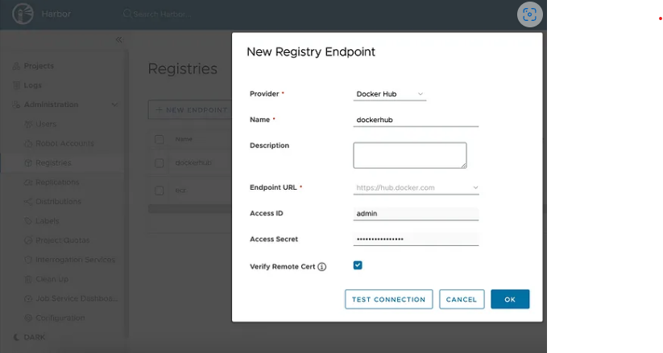
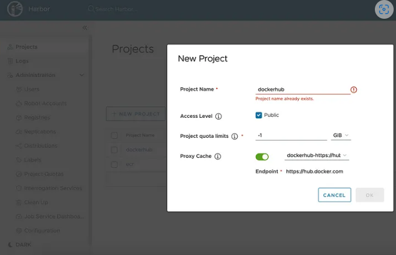

# Harbor를 이용한 Local Container Registry 프록시 구성

## Let's encrypt 등에서 인증서 발급

> [!Note]
> 사설인증서로 Image pull시 SSL오류발생하며 이를 해결하는 다양한 방법이 있으나 인증서 발급받는게 더 용이함.

## 인증서 등록
```bash
kubectl create secret tls harbor-tls --key ./privkey.pem --cert ./fullchain.pem -n default 
```

## harbor 설치
```bash
helm repo add harbor https://helm.goharbor.io

helm install --upgrade harbor harbor/harbor  --set persistence.persistentVolumeClaim.registry.storageClass=managed-csi-premium  --set persistence.persistentVolumeClaim.registry.size=100Gi  --set expose.type=loadBalancer  --set harborAdminPassword=<password>  --set externalURL='https://harbor.<your-domain>' --set expose.ingress.hosts.core='harbor.<your-domain>' --set expose.tls.certSource=secret --set expose.tls.secret.secretName=harbor-tls 
```

## Local cache구성

### 레지스트리 엔드포인트 생성



### 프로젝트 생성


## docker.io 를 로컬 harbor에서 가져오도록 웹훅 설정을 yaml로 정의
```yaml
rules:
 - name: 'docker.io rewrite rule'
   # image refs must match at least one of the rules, and not match any excludes
   matches:
     - '^docker.io'
   excludes:
     # for example, exclude ubuntu from harbor's proxy cache
     - '^docker.io/(library/)?ubuntu:.*$'
   replace: 'harbor.andrewmin.net/dockerhub'
   checkUpstream: false

```

## harbor 웹훅 설치

```bash
helm install harbor-container-webhook harbor-container-webhook/harbor-container-webhook -n harbor-container-webhook --create-namespace -f values-harbor-webhook-rule.yaml
```


### 테스트

```yaml

apiVersion: v1
kind: PersistentVolumeClaim
metadata:
  name: pytorch-pvc
spec:
  accessModes:
    - ReadWriteOnce
  resources:
    requests:
      storage: 100Gi
---

apiVersion: batch/v1
kind: Job
metadata:
  name: pytorch-job
spec:
  template:
    spec:
      containers:
      - name: pytorch-container
        image: pytorch/pytorch:latest
        command: ["python", "-c", "import torch; print(torch.__version__)"]
        volumeMounts:
        - mountPath: /mnt/storage
          name: storage
      imagePullSecrets:
      - name: regcred
      volumes:
      - name: storage
        emptyDir: {}
      restartPolicy: Never

```

* 직접 docker.io에서 가져올 경우 : 2m59s
* local harbor에서 가져올 경우 : 2m12s (약 26% 정도 빠름)

## Kubefleged 아키텍처링

### 설치

```bash
helm repo add kubefledged-charts https://senthilrch.github.io/kubefledged-charts/
helm install --verify kube-fledged kubefledged-charts/kube-fledged -n ${KUBEFLEDGED_NAMESPACE} --wait
```

### 이미지캐시 생성
```yaml
apiVersion: kubefledged.io/v1alpha2
kind: ImageCache
metadata:
  # Name of the image cache. A cluster can have multiple image cache objects
  name: imagecache1
  namespace: kube-fledged
  # The kubernetes namespace to be used for this image cache. You can choose a different namepace as per your preference
  labels:
    app: kubefledged
    kubefledged: imagecache
spec:
  # The "cacheSpec" field allows a user to define a list of images and onto which worker nodes those images should be cached (i.e. pre-pulled).
  cacheSpec:
  # Specifies a list of images (nginx:1.23.1) with no node selector, hence these images will be cached in all the nodes in the cluster
  - images:
    - pytorch/pytorch:latest
  # Specifies a list of images (cassandra:v7 and etcd:3.5.4-0) with a node selector, hence these images will be cached only on the nodes selected by the node selector
  # - images:
  #   - us.gcr.io/k8s-artifacts-prod/cassandra:v7
  #   - us.gcr.io/k8s-artifacts-prod/etcd:3.5.4-0
    nodeSelector:
      tier: backend
  # Specifies a list of image pull secrets to pull images from private repositories into the cache
  # imagePullSecrets:
  # - name: myregistrykey

```

### 상태확인
```bash
kubectl get imagecaches imagecache1 -n kube-fledged -o json
```

### 결론
Kubefledged는 사전 caching기능이라 각 노드에 1번은 pull을 해야 함. 따라서 신규 Node provisioning시에는 속도개선이 없음.


## Nsenter로 강제 Mount
Azure Files를 각 Node가 이미지 캐시로 사용하는 디렉토리를 강제로 Mount하는 방식


```yaml
apiVersion: v1 
kind: ConfigMap 
metadata: 
  name: nsenter-actions 
  labels: 
    app: nsenter 
data: 
  wasm: | 
    #!/usr/bin/env bash 
    set -xe 

    mount -t cifs //kubeflowsa.file.core.windows.net/fileshare1 /host/var/lib/containerd/io.containerd.content.v1.content -o vers=3.0,username=kubeflowsa,password='...=',dir_mode=0777,file_mode=0777,serverino 
 
```

```yaml
apiVersion: apps/v1
kind: DaemonSet
metadata:
  name: &name nsenter
  labels:
    app: *name
spec:
  selector:
    matchLabels:
      app: *name
  template:
    metadata:
      labels:
        app: *name
    spec:
      hostNetwork: true
      hostPID: true
      containers:
      - image: docker.io/alexeldeib/nsenter:latest
        imagePullPolicy: Always
        name: *name
        args: ["wasm"]
        resources:
          requests:
            cpu: 0.5
            memory: 2000Mi
          limits:
            cpu: 0.5
            memory: 2000Mi
        securityContext:
          privileged: true
        volumeMounts:
        - name: actions
          mountPath: "/opt/actions"
        - name: hostmount
          mountPath: "/mnt/actions"
      volumes:
      - name: hostmount
        hostPath:
          path: /opt/actions
          type: DirectoryOrCreate
      - name: actions
        configMap:
          name: nsenter-actions

```

```bash
Warning  FailedCreatePodSandBox  2m25s (x26 over 7m58s)  kubelet            Failed to create pod sandbox: rpc error: code = NotFound desc = failed to create containerd container: error unpacking image: blob sha256:b4b669f27933146227c9180398f99d8b3100637e4a0a1ccf804f8b12f4b9b8df expected at /var/lib/containerd/io.containerd.content.v1.content/blobs/sha256/b4b669f27933146227c9180398f99d8b3100637e4a0a1ccf804f8b12f4b9b8df: blob not found: not found
```
